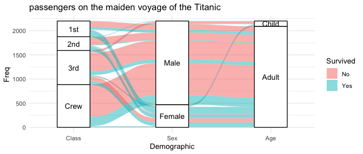
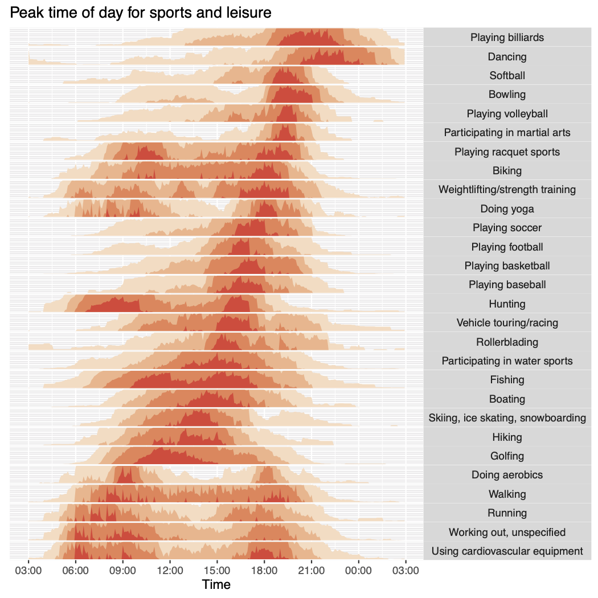

# ggplot_extensions_adventR

## About
This repo is dedicated to sharing 24 ggplot data visualization extensions, one for each day of the advent calendar. Starting with some basic ggplot plots, we will explore different extensions to visualize simple data.

## Gallery

### Day 1

### Day 2

### Day 3

### Day 4

### Day 5

### Day 6

### Day 7

### Day 8

### Day 9

### Day 10

### Day 11

### Day 12

### Day 13

### Day 14

### Day 15

